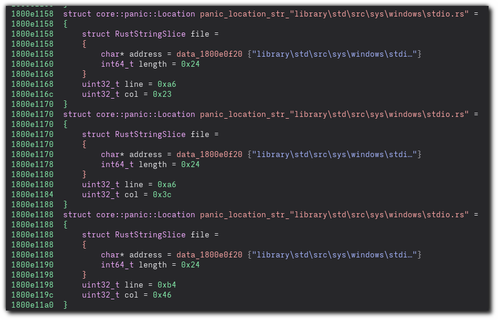

# Rust Metadata Carver
Find metadata in Rust binaries

## Description

WIP plugin to find metadata from Rust binaries, including:

- Source file locations from panic unwind metadata (i.e. `core::panic::Location` structs embedded in the binary) 

## Minimum Version

4689

## License

This plugin is released under an [MIT license](./LICENSE).

## Metadata Version

2